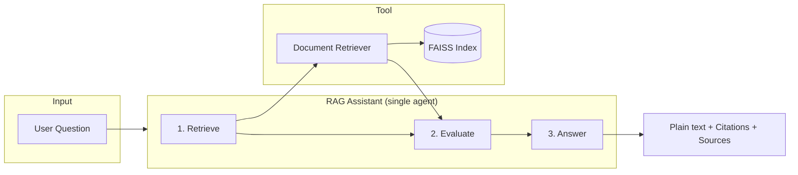

# Mini Agentic RAG (CrewAI)

A minimal RAG system with semantic chunking, Azure OpenAI embeddings, FAISS, and a single CrewAI agent that retrieves documents, evaluates sufficiency, and answers in one pass. Answers are plain text with inline citations and a Sources section at the end.

---

## Features

- Semantic chunking (LangChain) for better retrieval
- Azure OpenAI for embeddings and chat (gpt-4o-mini)
- FAISS vector store for similarity search
- Single RAG agent with tool calling (Document Retriever)
- One-pass flow: retrieve → evaluate → answer
- Plain-text answers with citations and Sources list
- FastAPI and CLI interfaces

---

## Architecture

### System overview

```
┌─────────────────────────────────────────────────────────────────────────────┐
│                           OFFLINE: INGEST                                    │
├─────────────────────────────────────────────────────────────────────────────┤
│  data/docs/ (.pdf, .txt, .md, .rst)                                         │
│         │                                                                   │
│         ▼                                                                   │
│  Load documents  →  Semantic chunking  →  Azure OpenAI embeddings           │
│         │                                                                   │
│         ▼                                                                   │
│  FAISS index (faiss_index/)                                                 │
└─────────────────────────────────────────────────────────────────────────────┘

┌─────────────────────────────────────────────────────────────────────────────┐
│                           ONLINE: QUERY                                      │
├─────────────────────────────────────────────────────────────────────────────┤
│  User question  →  API / CLI  →  Crew (1 agent, 1 task)                     │
│                              →  RAG Agent                                   │
│                                    │                                        │
│                                    ├─► Document Retriever tool              │
│                                    │        │                               │
│                                    │        ▼                               │
│                                    │   FAISS similarity_search              │
│                                    │                                        │
│                                    ▼                                        │
│                             Evaluate sufficiency                            │
│                                    │                                        │
│                                    ▼                                        │
│                             Answer (or “insufficient”)                      │
│                             + citations + Sources section                   │
└─────────────────────────────────────────────────────────────────────────────┘
```

### Agent and steps (one pass)

The RAG agent performs three steps in a single LLM pass:



| Step | Description |
|------|-------------|
| 1. Retrieve | Agent calls the **Document Retriever** tool with the question. The tool runs a FAISS similarity search (Azure embeddings) and returns the top-k chunks. |
| 2. Evaluate | Agent decides whether the retrieved chunks are **sufficient** to answer the question. |
| 3. Answer | If sufficient: answer in **plain text** with inline citations (e.g. [1], [2]) and a **Sources** section at the end. If not: state that the retrieved docs are insufficient. |

No markdown is used in the answer; output is plain text with line breaks and a final Sources list.

---

## Project structure

```
├── data/
│   └── docs/              # Put .pdf, .txt, .md, .rst files here
├── faiss_index/           # Created by ingest (do not edit)
├── app/
│   ├── config.py          # Azure OpenAI settings from .env
│   ├── embeddings.py     # Azure embeddings (rate-limited)
│   ├── ingest.py         # Semantic chunking + FAISS index build
│   ├── retriever.py      # FAISS retrieval (retrieve_context)
│   ├── tools.py          # CrewAI tool: Document Retriever
│   ├── agents.py         # Single RAG agent (CrewAI)
│   ├── tasks.py          # Single task: retrieve → evaluate → answer
│   ├── crew.py           # Crew orchestration (1 agent, 1 task)
│   ├── api.py            # FastAPI server
│   └── cli.py            # Interactive CLI
├── .env.example
├── requirements.txt
└── README.md
```

---

## Requirements

- Python 3.10+
- Azure OpenAI resource (embeddings + chat deployments)

---

## Setup

From the project root:

```bash
python -m venv env
source env/bin/activate   # Windows: env\Scripts\activate
pip install -r requirements.txt
```

Copy `.env.example` to `.env` and set your Azure OpenAI values:

```env
AZURE_OPENAI_ENDPOINT=https://your-resource.cognitiveservices.azure.com
AZURE_OPENAI_API_KEY=your-key
AZURE_OPENAI_CHAT_DEPLOYMENT=gpt-4o-mini
AZURE_OPENAI_EMBEDDING_DEPLOYMENT=text-embedding-ada-002
AZURE_OPENAI_API_VERSION=2024-02-15-preview
```

Optional (if you hit rate limits):

```env
EMBEDDING_RATE_LIMIT_DELAY_SECONDS=0.5
```

---

## Usage

### 1. Add documents

Place files in `data/docs/` (e.g. PDFs, .txt, .md, .rst).

### 2. Ingest (build FAISS index)

Run once (or after adding/updating docs):

```bash
python -m app.ingest
```

### 3. Ask questions

CLI (interactive):

```bash
python -m app.cli
```

API:

```bash
uvicorn app.api:app --reload
```

Then:

```text
GET /ask?q=Your+question
GET /health
```

---

## Configuration summary

| Variable | Purpose |
|----------|---------|
| AZURE_OPENAI_ENDPOINT | Azure OpenAI base URL |
| AZURE_OPENAI_API_KEY | API key |
| AZURE_OPENAI_CHAT_DEPLOYMENT | Chat model (e.g. gpt-4o-mini) |
| AZURE_OPENAI_EMBEDDING_DEPLOYMENT | Embedding model (e.g. text-embedding-ada-002) |
| AZURE_OPENAI_API_VERSION | API version |
| EMBEDDING_RATE_LIMIT_DELAY_SECONDS | Optional delay between embedding calls |

---

## Output format

The agent returns:

- Plain text only (no markdown).
- Inline citations (e.g. [1], [2] or section names).
- A **Sources** section at the end listing each document/section used.
- If the retrieved docs are not sufficient, a clear statement that they are insufficient.

---

## License

Use as needed for the assessment or project.
